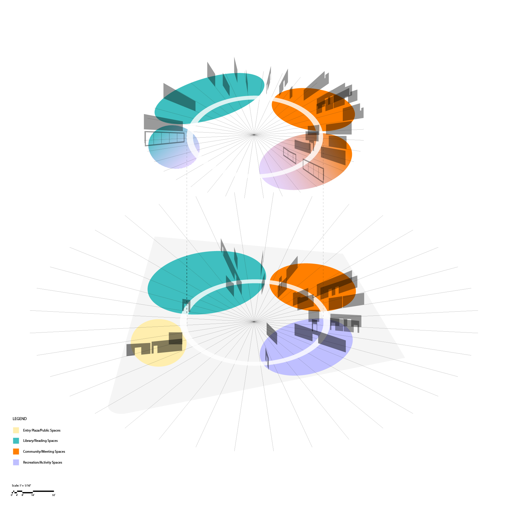
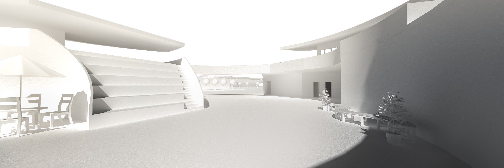
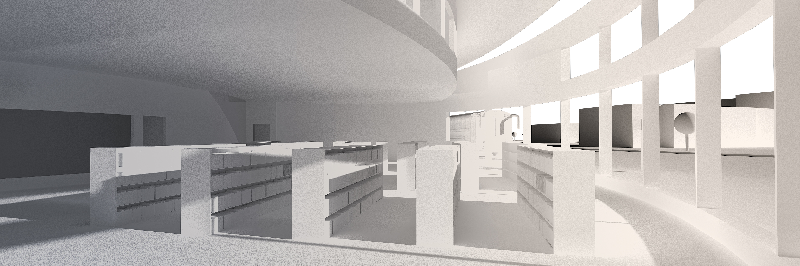
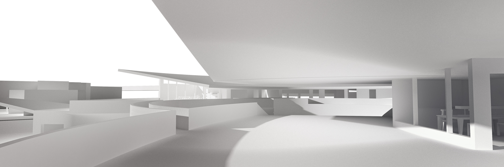

# Contra Costa Community Commons (CCCC)

Studio Project (Fall 2020) 
Site: El Cerrito, CA | 34500 sqft

	

 The Contra Costa Community Commons will be a public building that serves the local neighborhoods of El Cerrito and Richmond, as well as the greater Contra Costa and Bay areas. Acting as a social condenser, the CCCC will house a varied set of public programs that bring together and empower the diverse communities that it serves. 

	

	

 We were tasked to conceive and compose complex room-to-room relations through a series of small scale, indoor and outdoor community based programs, articulating a specific organizational attitude in the typological formation of a two-story mat building. Discretization of surfaces and the distribution of architectural elements will take cues from the site conditions and speak to larger contextual claims. 
	
My project is a sanctuary for people in the community to read, exercise or meet. These three functions, together with a public space, are separated into nodes, joined by a continuous meandering hallway. Program wraps around a center courtyard, creating a smaller microcosm of the community that is inviting yet protected. The plaza draws the public in while maintaining an intimate connection across the two floors of the circular deck. Windows open into the hallway, allowing users within the center to peek into any rooms if they wish, while maintaining privacy from the public eye. Roofs are peeled back for the same reason.

 ***
 

  
  &nbsp;
  &nbsp;
   

  
  &nbsp;
  &nbsp;
   

  

 
 

