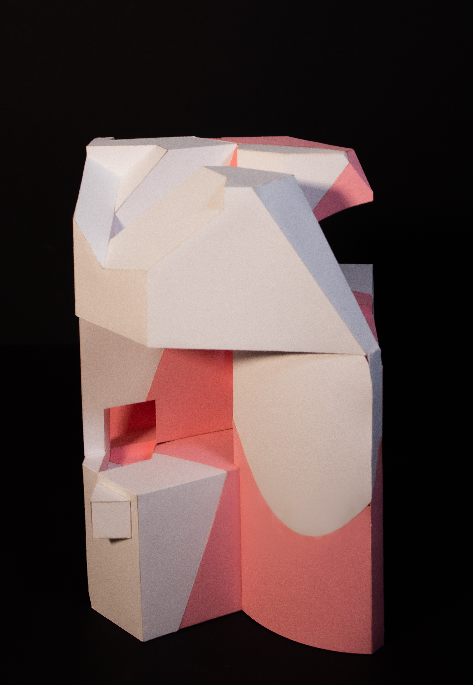
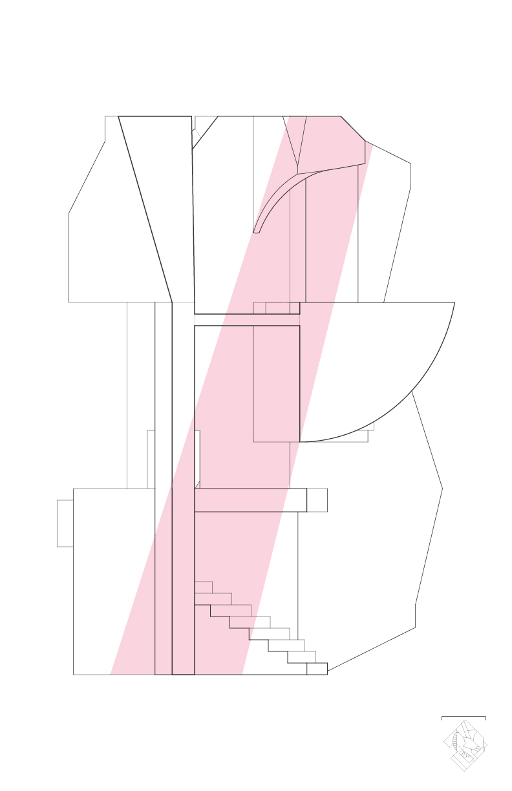

# Spatial Projection
Studio Project (Fall 2019)  
**Materials**: Bristol, Canson Paper (300gsm)  
**Tools**: Rhino 3D, Adobe Illustrator
	
**Part I - PROJECTED MODULATION**: line-to-solid and back again  
	

 This project was an introduction to the theories and techniques of orthographic projection as the primary means of representation in architecture. By using 2D to 3D projection, we created a series of 8 solids. 

	
***
	
**Part II - SPATIAL CONSTURUCT**: solid-to-surface and back again 

	

 Boolean operations and part-to-part aggregations start to transition the solid into surfaces and spaces. The introduction of interiority, scale, and
architectural figures, such as staircases are added to the object to give it a sense of scale. 

My project focuses on ascension, with narrow forms twisting and turning as they rise up to the full 12-inch of the object. This contrasts with the circulation path, which ascends more gradually, in a circumambulatory fashion and with rounded angles.
 

  
  &nbsp;
  &nbsp;
  
  &nbsp;
  &nbsp;
   

  
  

  
  
  
  

