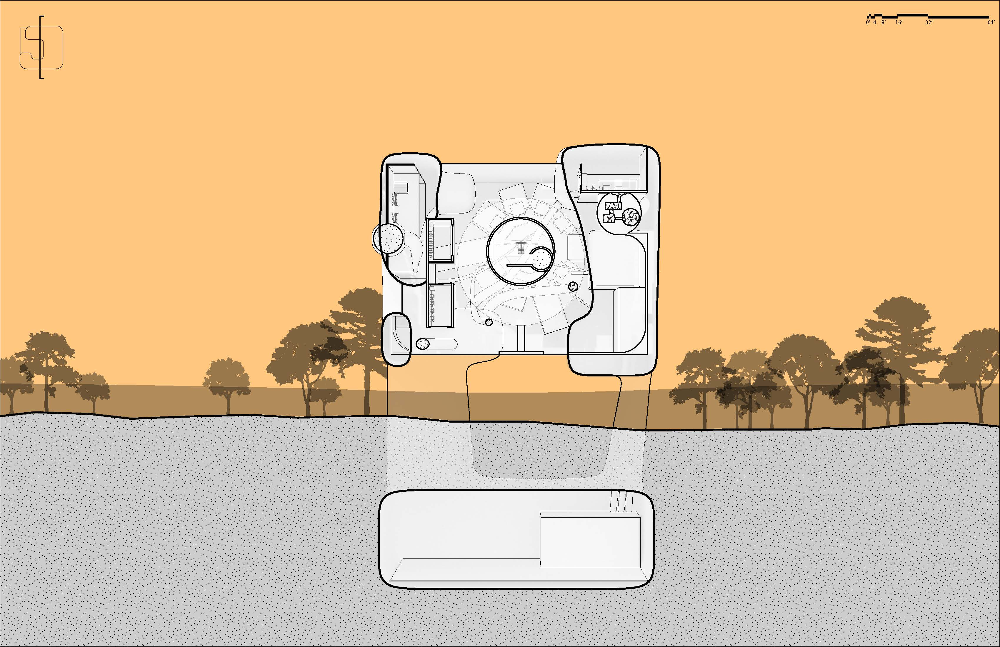

# Design Futuring - Through the 4th Wall

Studio Project (Fall 2022) 

***
> immersive worlds + digital twins + simulation tools

Exploring the role and agency of architectural design for possible, probable, and preferable futures.

The first part of the studio consists of a series of field trips to virtual worlds, to understand how existing immersive environments "teach" its users to effectively engage with them through personal observation.

### Process

  
  &nbsp;
  &nbsp;
   

\

### Output

