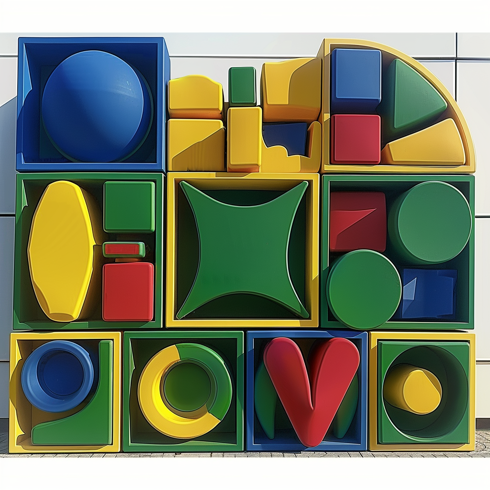
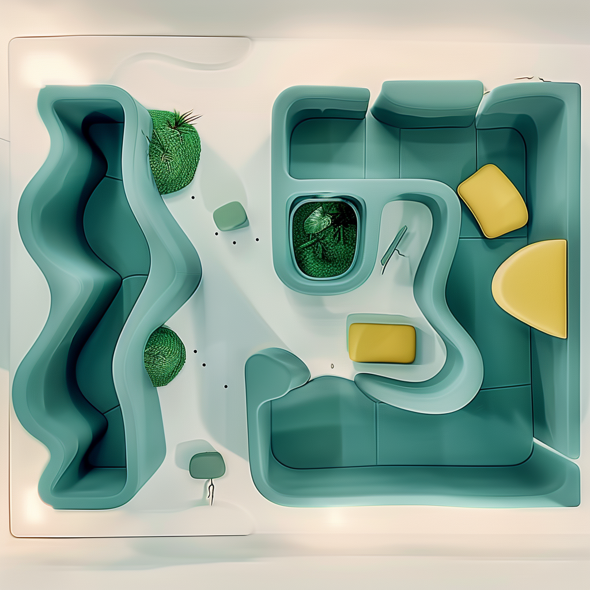
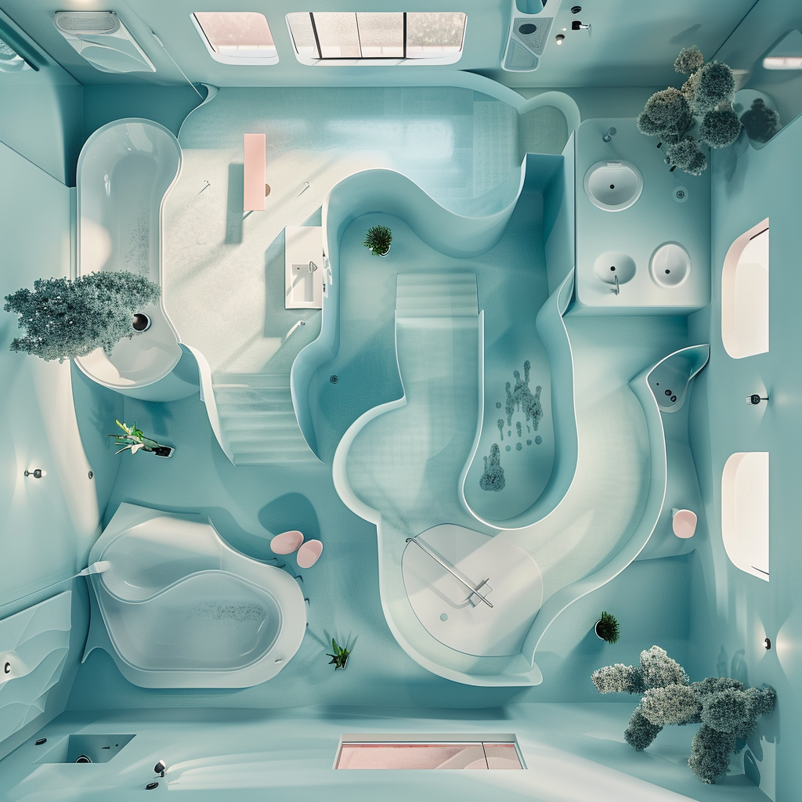
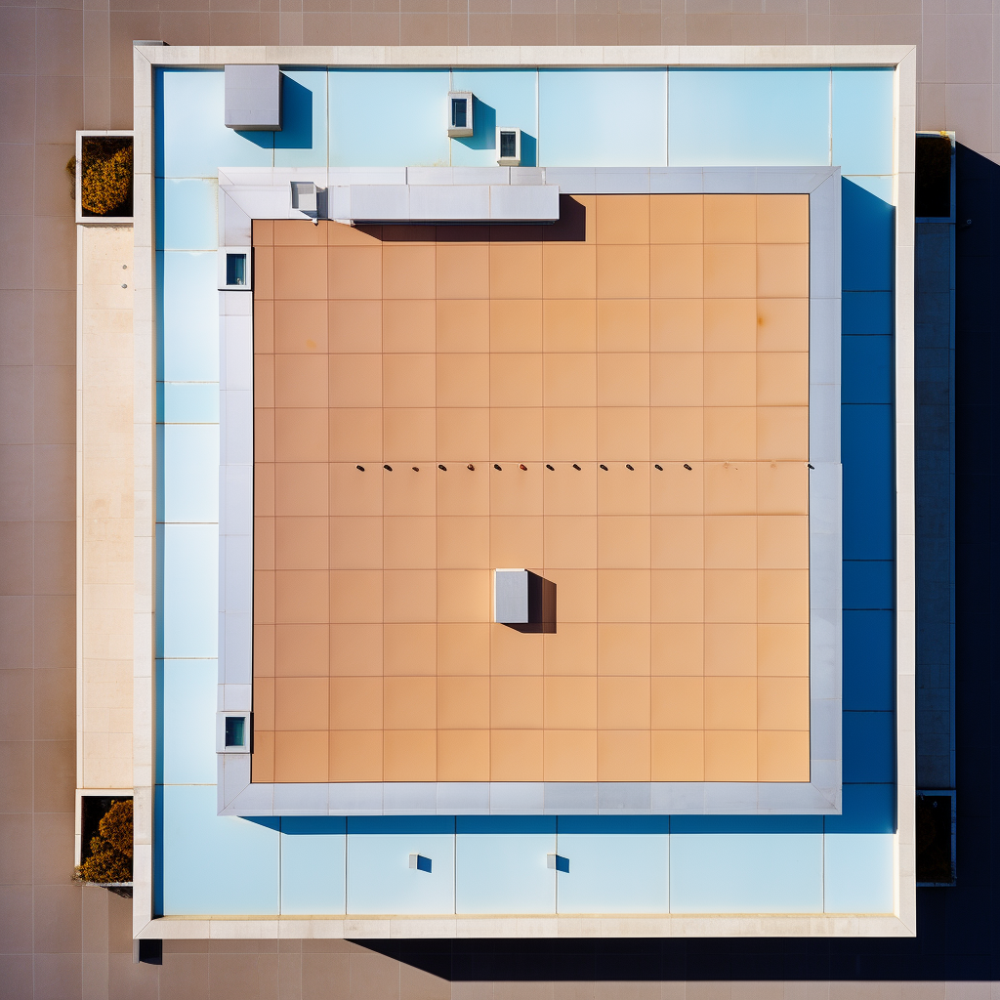
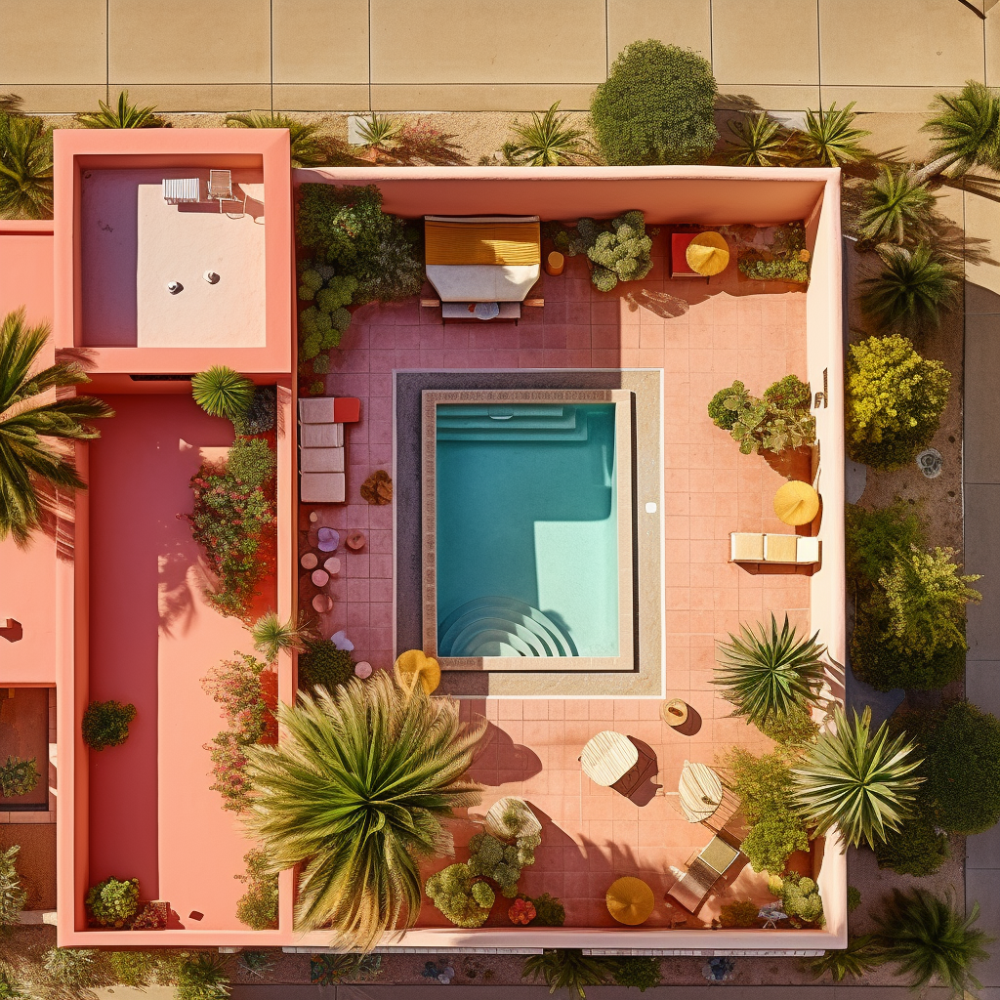
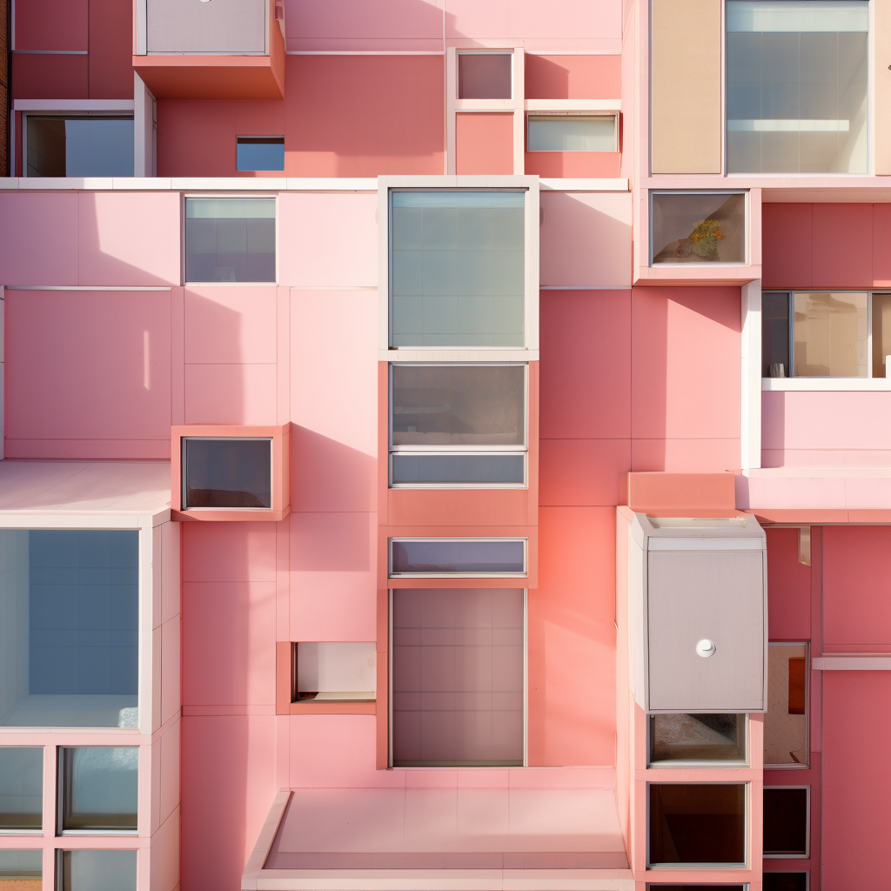

# Elements of an (AI) Architecture

Design Workshop (Spring 2024) 
Tools: Midjourney AI, Adobe Generative Fill

***
The collage above is composed of over 50 images generated using Midjourney. The prompts were taken from architectural elements in Rem Koolhaas' <i>Elements of Architecture</i>. 

