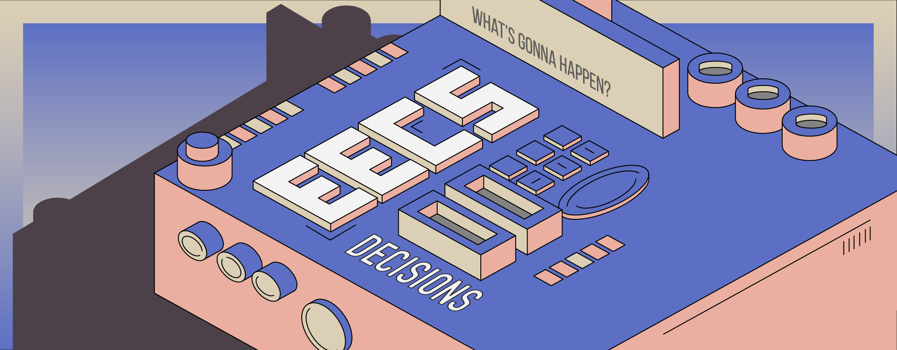
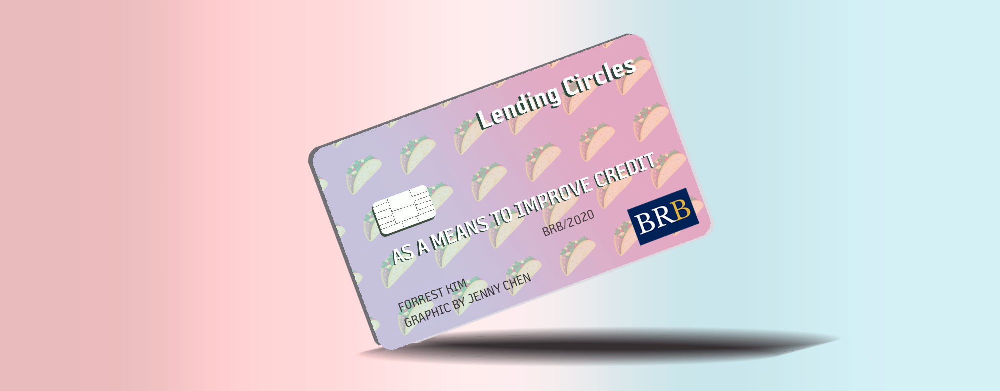
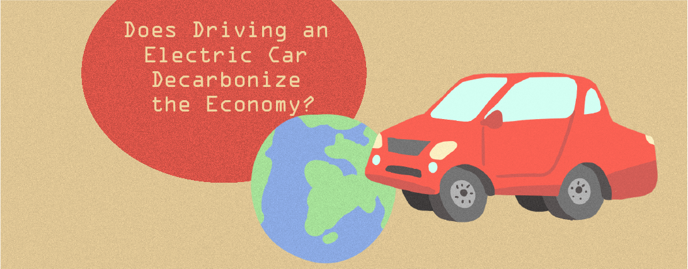

## Article Headers

**For**: Business Review At Berkeley 
**Duration**: Fall 2018 - Present 
**Tools**: Procreate, Adobe Photoshop 

 This is a series of article headers I illustrated for [Business Review Berkeley](https://businessreview.berkeley.edu/), UC Berkeley's Premier Undergraduate Business Journal. 

