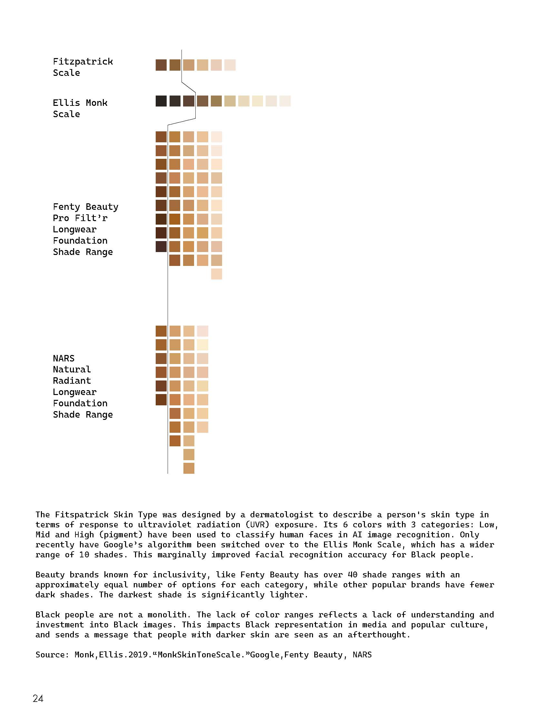
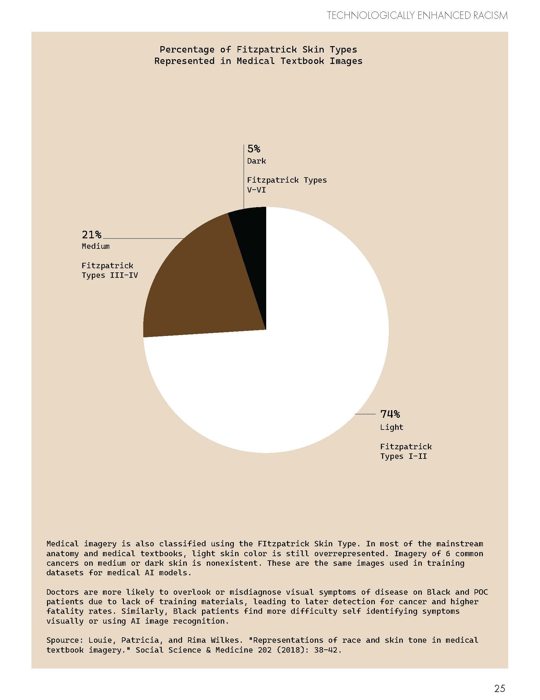
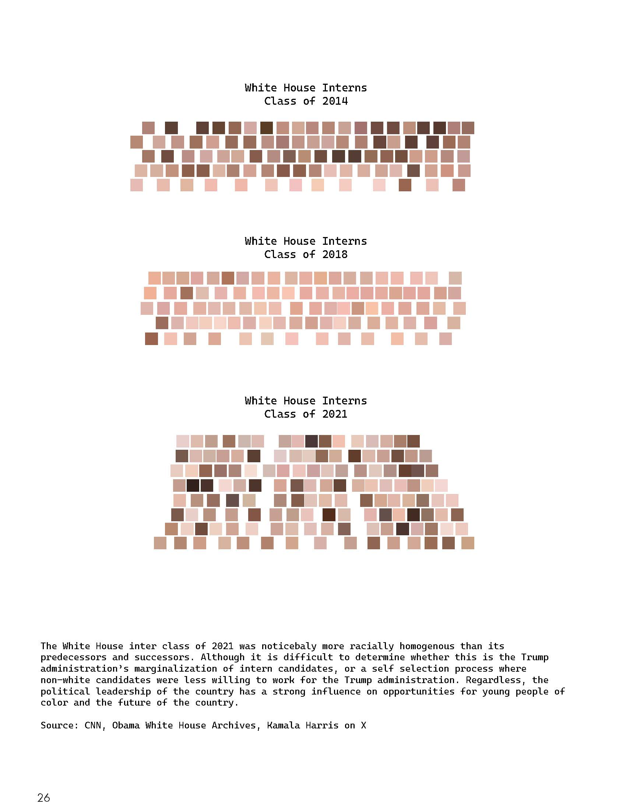
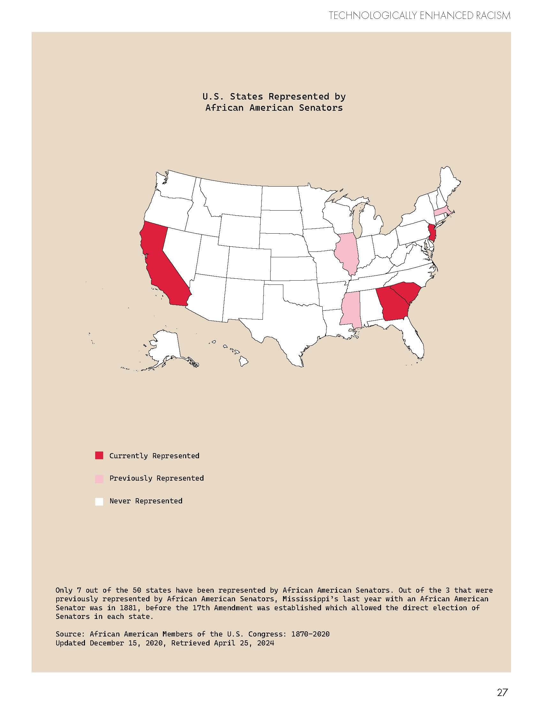
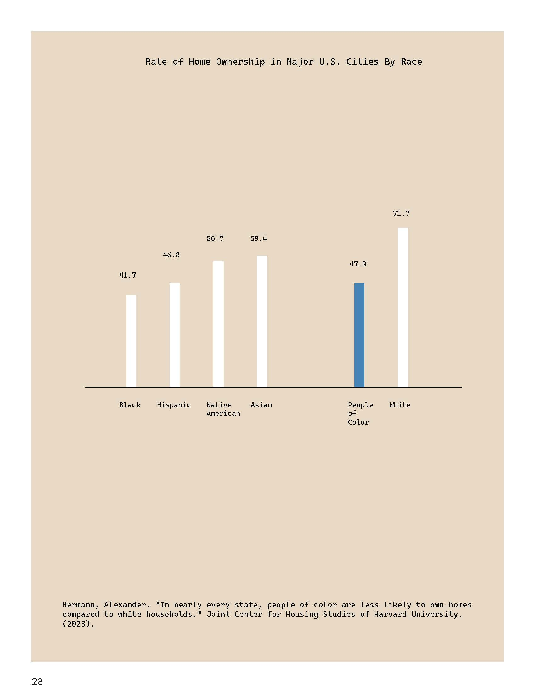
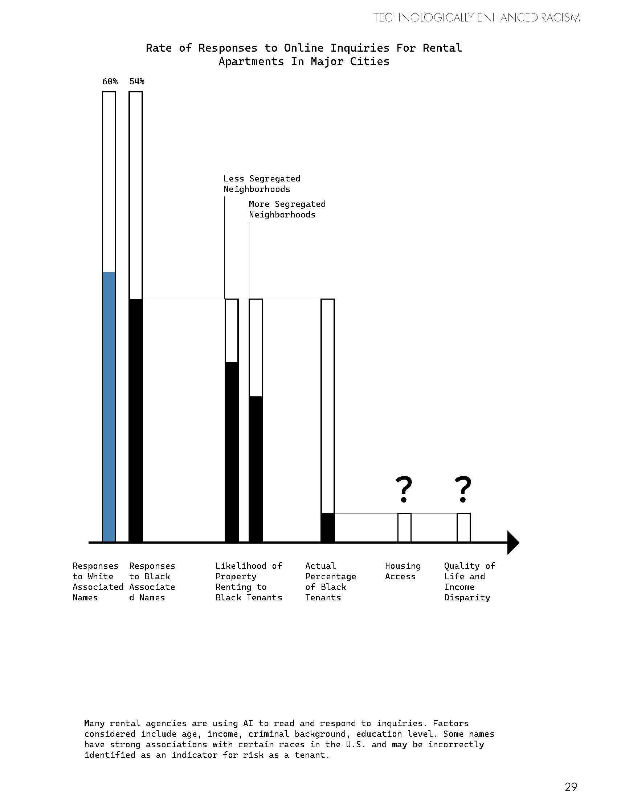
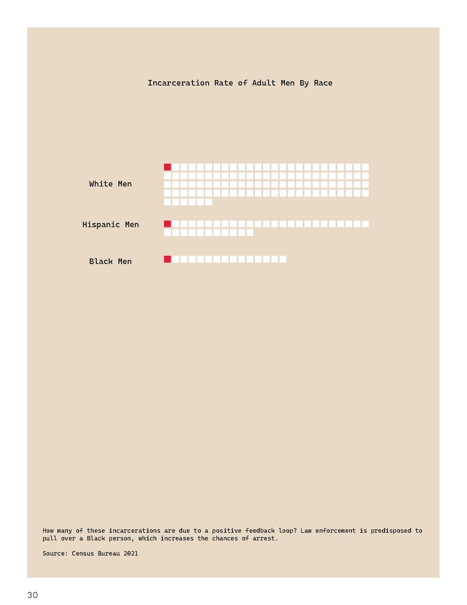
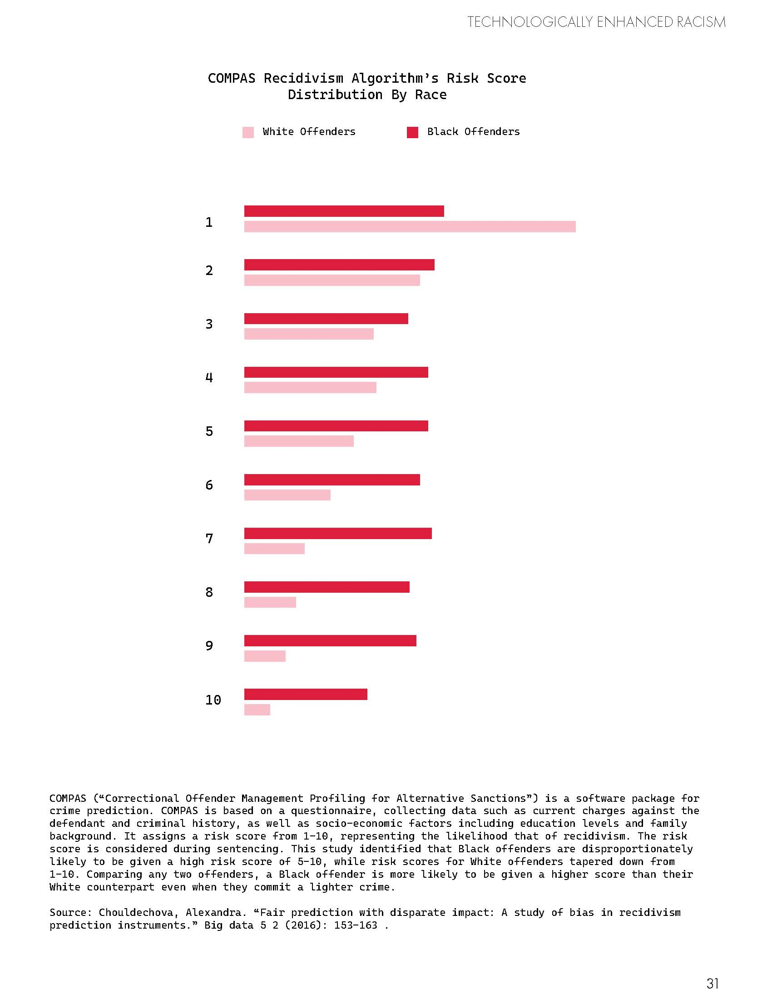

# Modern Du Bois: Technologically Enhanced Discrimination

Spring 2024

162 years after the Emancipation Proclamation, Black people today are still facing discrimination in many aspects in life. These DuBois style charts highlight inequity faced by modern Black people in 4 domains: Skin Color (with relation to the medical field and microaggressions in cosmetics), Law Enforcement, Access to Housing, and Governance and the Future of the Country. Resources and artifacts of modern life need to be reexamined before they are digitized de-facto, in order to break the cycle and ensure equitable access to basic needs and wealth building opportunities to overcome years of systemic racism.

