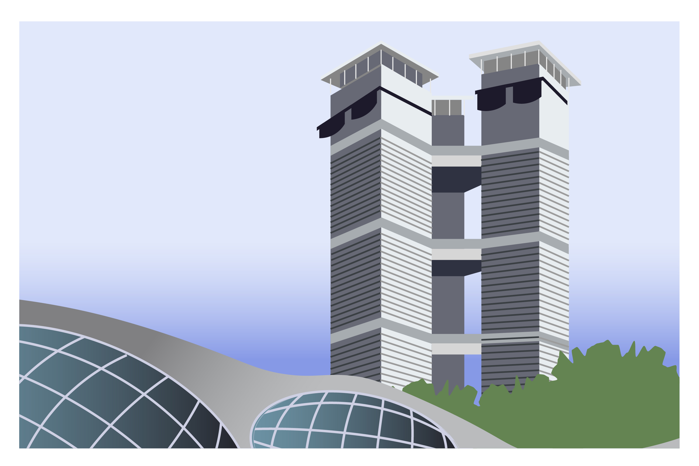
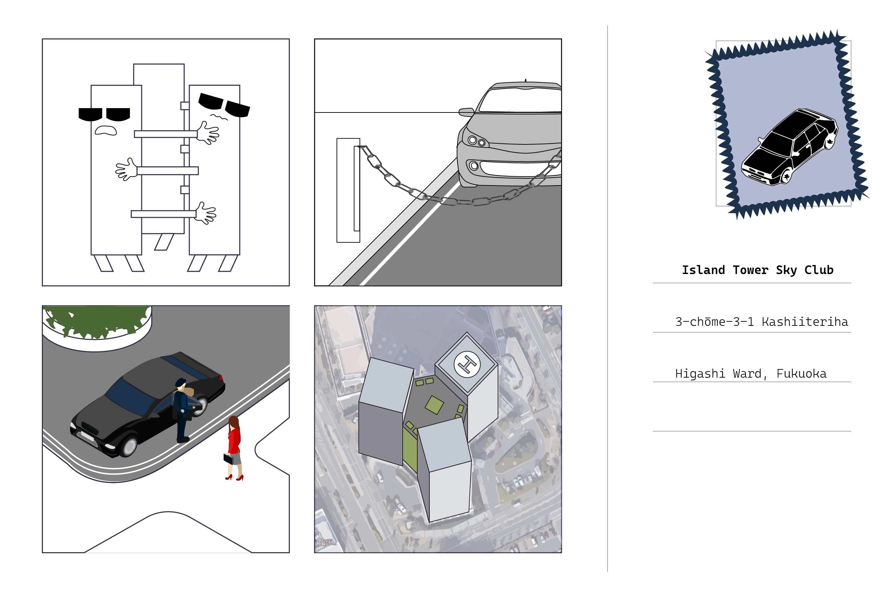

# Hello From ...

Individual Project (Summer 2023) 

My project examines apartment complexes in cities that we have visited on the trip. From observation, I noticed that many apartment complexes exhibit a certain degree of enclosure or barrier to access. They range from a subtle change in floor pattern or vegetation growth, to elaborate gates with electrical car fences and security booths. While fully “gated” communities are very common in Korea, they are less common in Japan. This is likely due to urban policies that mandate each apartment block to be directly connected to a public road. This creates an interesting contrast between apartments built in the same time frame and exclusivity level.

&nbsp;
&nbsp;

The four complexes I picked are: Nexus World and Island Tower Sky Club in Fukuoka, Samik Beach Town in Busan, and Hermann House Complex in Paju Book City. For each building, I imagined what a postcard from each complex would look like, showing the characteristics that can be experienced by a casual visitor. These complexes are not located in world-class cities like Tokyo and Seoul, but they exhibit strong brand identities even from the outside. Their levels of privacy and security are revealed through the “scenes” on the back of the postcard. For example, Samik Beach Town is more open, with visitors and residents alike using the public transport facilities within the complex. Island Tower Sky Club is characterized by chain-link fences for cars and multiple security personnel donning suits and sunglasses. 

On a larger scale, this reveals the attitude of each community towards its surroundings, as well as how the neighborhood or city views the community. 
