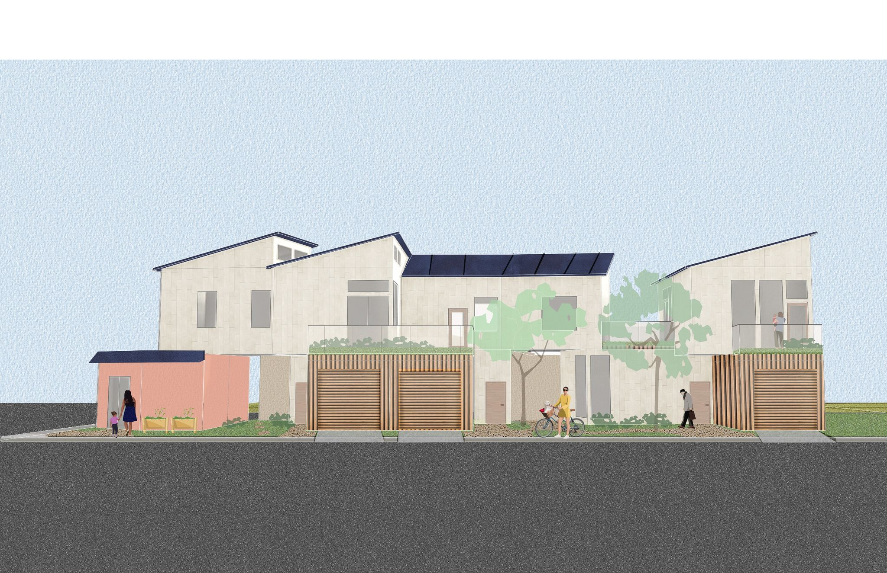

# Low Rise Los Angeles Competition

Competition Entry (Spring 2022) 

This design aims to bolster support for new multi-unit residential architecture in Los Angeles through the thoughtful integration of new housing to existing communities in its porous, weaving ground level gardens and play areas, community store, and elevated communal outdoor spaces. 

In all, the combination of design gestures encourages the formation of an amicable and healthy neighborhood that not only provides a vibrant new micro-community but also gives back to the existing low-rise communities. Future interventions will have similar potential to give back to existing communities, increase density, and establish livable, walkable neighborhoods.

