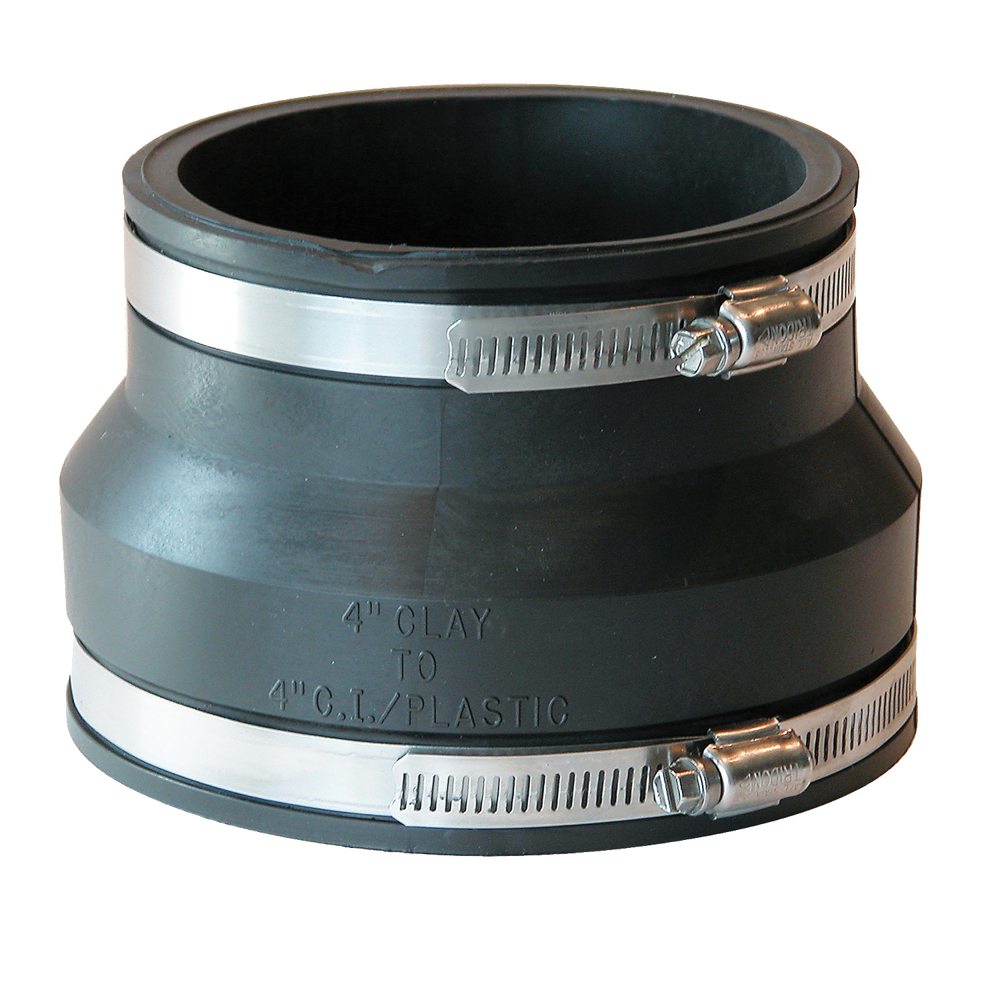

# Waste Too, Want Too

Media Project (Spring 2023) 
**Tools**: Houdini, Blender, Rhino 3D  

 Performing photogrammetry on a found object, subsequently recreating its production and post-consumer processes.

  

  
Point cloud object from photogrammetry (left) and a render of it (right).

Part two of the project explores taking imprints of the deformed object, along with other post-consumer waste to create new use cases.
