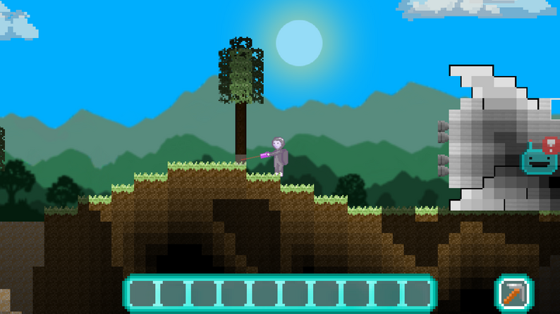
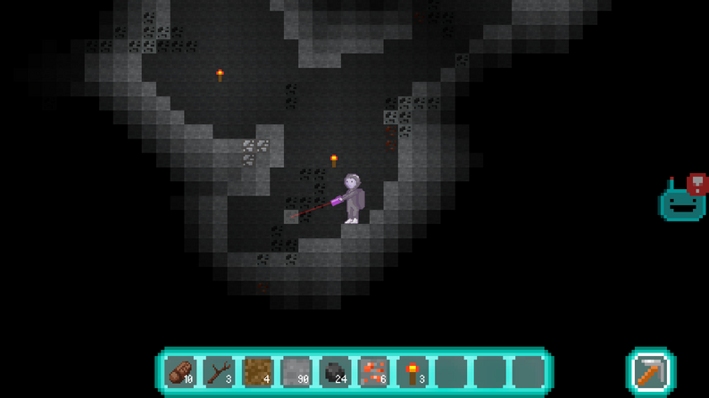
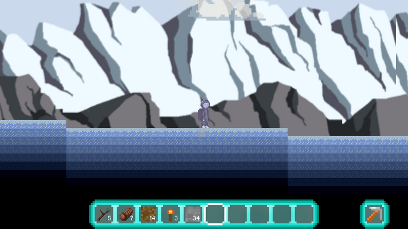

## Planemo

**Duration**: March - May 2019  
**Tools**: Unity 3D, Adobe Photoshop, Procreate  

 Planemo is like Minecraft meets Terraria in a procedurally generated, sandbox world (no fall dmg?). You crash landed on an alien planet, your spaceship is damaged and you need to craft supplies to repair it. Features include day-night cycles, underground mining and a different planet each time you start a new save file, so you will never know where the copper is.

I made this game with a team of 4 for our final project in the Games Design and Development Decal ([gdd](https://gamedesign.berkeley.edu/)). As the only artist, I illustrated all the assets and animated them in Unity.

You can download it [here](planemogame.itch.io)!
