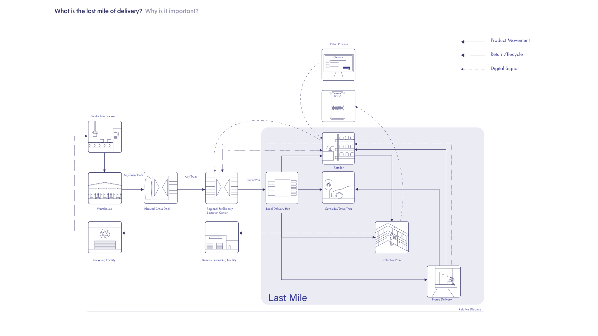

# Mile Marker: An Architect's Catalog of Designs for the Last Mile of Parcel Delivery

Independent Research (Spring 2023) 
Advisor: Brian Lonsway

***
Ecommerce is on the rise. In NYC alone, 2.4 million packages are delivered each day. While retail becomes increasingly digital, the packages still occupy urban space.

### Last Mile of Parcel Delivery

The Last Mile refers to the last leg of delivery where the parcel moves from a fulfillment hub to the destination. On average, it covers a distance of 6 miles in dense urban areas. It is the shortest yet most expensive and carbon intensive phase of delivery. 

The architectural spaces of the last mile, such as its roadways and warehouses, prioritizes standardization, cost effectiveness and efficiency. These priorities are reshaping the urban environment, evident in the ever-widening highways and looming warehouses. Aspects that are often overlooked are experience, aesthetics and wellbeing, especially for pedestrians and warehouse workers. Spaces built for the delivery process should reflect the needs of people and communities that interact with it.

***

### The 8 Elements of the Last Mile

Last mile is an interdisciplinary area of interest, with applications in business, retailing, civil and transportation engineering, operations management and social sciences. Literature in the last mile is segregated and studies were focused on improving cost or time for delivery companies. Architectural thinking can consolidate the insights across multiple disciplines and implement them in the physical space. 

From the literature review, I selected 8 crucial, tangible, emerging elements of the last mile that, if implemented, would have positive impacts on the environment, and also had further architectural potential.
Each of these were visualized and understood through design.

These elements, visualized, allow architects and planners to design better spaces for the last mile. I am proposing a new typology of building: a “Last Mile Building”, to absorb functions currently carried by curb/road within a city, and to vertically integrate the 3 phases of the last mile.

### 18 Modules of the Last Mile

The 8 elements are reconfigured into 18 pre-designed modules that can be directly used when considering programmatic needs for the last mile building.

---
An example that shows the potential of how the modules can be combined to form a prototypical last mile building.

This research aims to contribute knowledge towards a future guidebook that could aid in the design of buildings and urban spaces that are able to absorb and neutralize the negative externalities of last mile activities in the city, while becoming a more positive experience for individuals, communities and the environment.